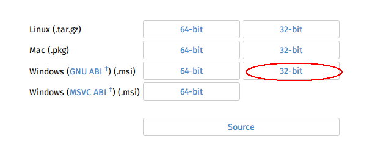
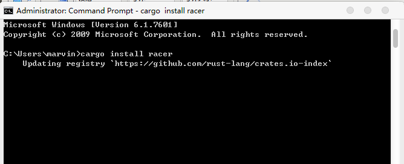
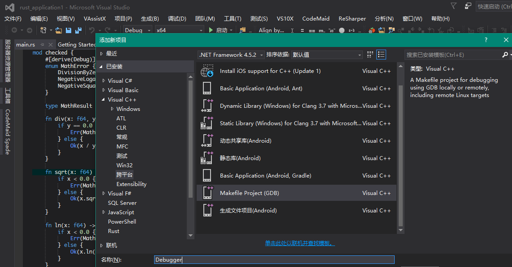
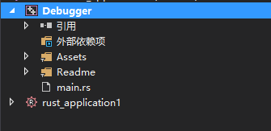

# Visual Studio
本文是使用VisualRust和VS GDB Debugger / VisualGDB 完成在VisualStudio中，编辑和调试Rust程序。

## 7.1 安装Rust, Cargo

首先需要下载Rust, 下载地址https://www.rust-lang.org/downloads.html

这里一定要下windows GNU ABI的版本, 因为我们要用GDB来调试.

另外，机器上也需要安装Visual Studio2013或2015。
安装完Rust,打开命令行，执行
cargo install racer

Racer是用来做Rust自动完成的，会在VisualRust使用。这里我们使用rust编译的racer, 并不用VisualRust里自带的racer，因为它太旧了.
另外需要下载Rust源代码，设置
RUST_SRC_PATH为Rust源代码src的目录

## 7.2 安装VisualRust和VS GDB Debugger

做完上述工作，就可以安装VisualRust和VS GDB Debugger,在这里下载 
https://github.com/PistonDevelopers/VisualRust
https://visualstudiogallery.msdn.microsoft.com/35dbae07-8c1a-4f9d-94b7-bac16cad9c01

VisualGDB可在这里购买
http://www.visualgdb.com/

## 7.3 编译Rust项目

新建Rust项目

在tool, option里设置racer和rust_src_path

这时候就可以在写代码的时候就可以自动提示了。像下面这样

## 7.4 用VS GDB Debugger调试Rust项目

ok,愉快的开始你的Rust之旅吧。下面开始使用VS GDB Debugger调试Rust.

在解决方案中，添加GDB调试项目

设置需要调试的程序所在的目录和文件名

设置需要调试的程序的编译命令，此处用rustc，也可以使用cargo编译

将需要调试的程序的源代码添加到项目目录下

打开源代码文件并设置断点信息，将项目设置为启动项目并选择Local GDB即可开始调试

## 7.5 用VisualGDB调试Rust项目

Build完Rust程序，点击debug, 选择quick debug with gdb

然后在里面选择MingW和exe的路径

 点击Debug,开始你的调试生活吧

